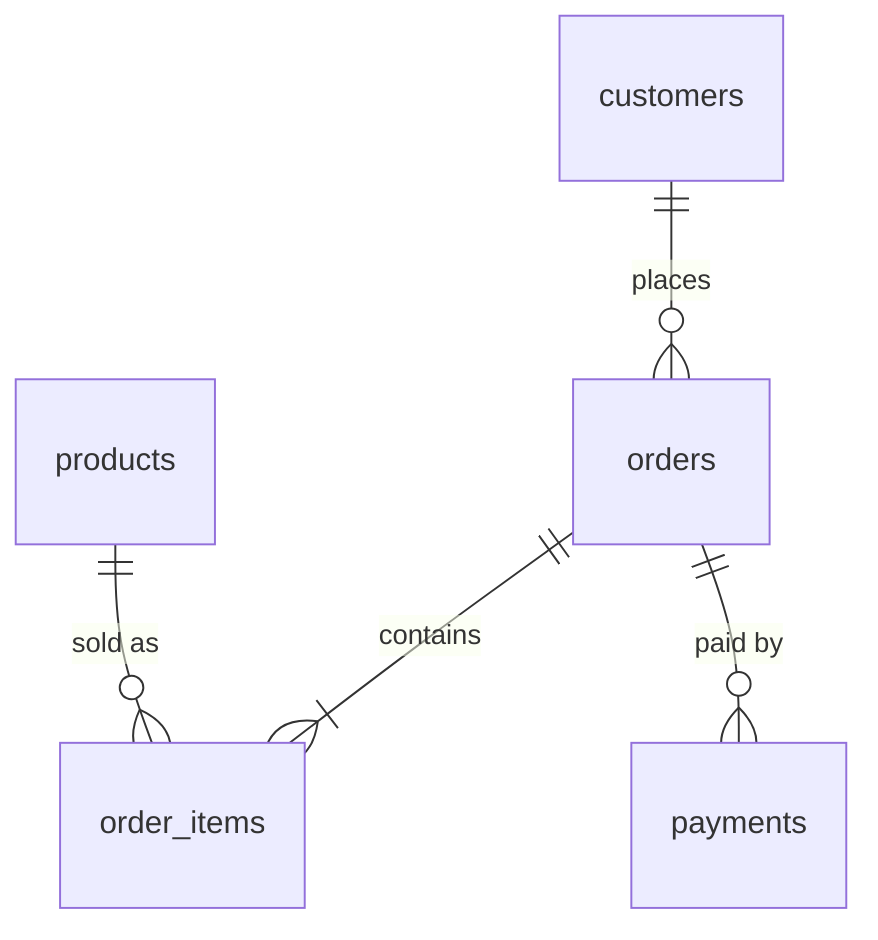

# Enterprise Sales & Customer Data Platform

> Status: **Phase 15 of 16 complete** (Ingestion, Bronze, Silver, Gold star schema, Data Quality, Airflow orchestration, CI/CD, SQL audit views, and Power BI DAX metrics). Sections marked _TBD_ are filled
> in as the matching phase is built. Nothing here is claimed to work until it has been run.

## 1. Project overview
End-to-end data engineering project: ingest sales data from PostgreSQL, a REST API and files,
process it through a Bronze/Silver/Gold lakehouse on Delta Lake with PySpark, orchestrate with
Airflow, validate with automated data-quality checks, and serve a star schema to Power BI.

## 2. Business problem
_TBD (Phase 16)_

## 3. Architecture
See [docs/architecture.md](docs/architecture.md).

## 4. Technology stack
Python, SQL, PostgreSQL, PySpark, Delta Lake, Airflow, Docker, GitHub Actions, Pytest, Ruff,
Black. Optional: AWS S3 / RDS, Databricks, Power BI.

## 5. Data sources
Synthetic and reproducible. PostgreSQL (5 tables, ~250k rows), a mock REST API
(exchange rates) and CSV/JSON files, with deliberately injected data defects.
See [docs/data_sources.md](docs/data_sources.md).

## 6. Data model
Source schema: [sql/postgres/001_schema.sql](sql/postgres/001_schema.sql).

Star schema (Gold): _TBD (Phase 6)_

## 7. Bronze / Silver / Gold architecture
_TBD (Phases 4-6)_

## 8. Pipeline workflow
Extraction is implemented (Phase 3): sources -> landing zone, with watermarks, atomic batches,
retries and an audit trail. See [docs/ingestion.md](docs/ingestion.md).
```bash
docker compose run --rm app python -m edp.ingestion     # incremental run of all sources
```
Full DAG: _TBD (Phase 9)_

## 9. Incremental processing
Ingestion side is done (Phase 3): PostgreSQL uses a bounded `updated_at` window on the database
clock, the API uses `updated_since`, files are tracked by name + SHA-256. Delivery is
at-least-once; deduplication and MERGE logic arrive in Phase 7. Details: [docs/ingestion.md](docs/ingestion.md).

## 10. Data quality
_TBD (Phase 8)_

## 11. Airflow
_TBD (Phase 9)_

## 12. Docker
_TBD (Phase 10)_ Currently `docker compose run --rm app` runs the test suite.

## 13. CI/CD
_TBD (Phase 12)_

## 14. AWS architecture
_TBD (Phase 13)_

## 15. Power BI
_TBD (Phase 14)_

## 16. Testing
```bash
pytest                 # unit tests
ruff check .           # lint
black --check .        # formatting
```

## 17. Monitoring
Every ingestion run is audited in `pipeline_runs` (status, rows extracted/landed, watermark range,
error type/message). Dashboards and views: _TBD (Phase 15)_.

## 18. Security
Secrets live only in `.env` (git-ignored). Copy `.env.example` to `.env` and fill it in.
Never commit credentials.

## 19. Local setup
Prerequisites: Docker Desktop, Git. Optional: Python 3.11-3.12 for running tests without Docker.
```bash
cp .env.example .env                           # then set POSTGRES_PASSWORD and API_KEY
docker compose up -d --build postgres mock-api  # PostgreSQL (schema auto-created) + mock API
docker compose run --rm app python -m data_generation.generate all   # ~90 s: files + load DB
docker compose run --rm app python -m edp.ingestion   # ingest all sources into data/landing
docker compose run --rm app pytest              # unit tests
docker compose run --rm app pytest -m integration   # tests against the live database
```
If host port 8000 or 5432 is busy, change `MOCK_API_PORT` / `POSTGRES_PORT` in `.env`.

## 20. Deployment
_TBD (Phase 13)_

## 21. Example pipeline execution
_TBD (Phase 16)_

## 22. Future improvements
_TBD (Phase 16)_

## Repository layout
```
src/edp/            installable package (common, ingestion, transformations, quality)
dags/               Airflow DAGs (thin wrappers)
sql/                Postgres DDL and analytics views
data_generation/    synthetic data + mock API
config/             pipeline YAML (no secrets)
tests/              unit and integration tests
docker/             Dockerfiles
dashboards/         Power BI requirements and DAX
infra/aws/          optional cloud deployment guide
docs/               architecture, ADRs, data sources
```
