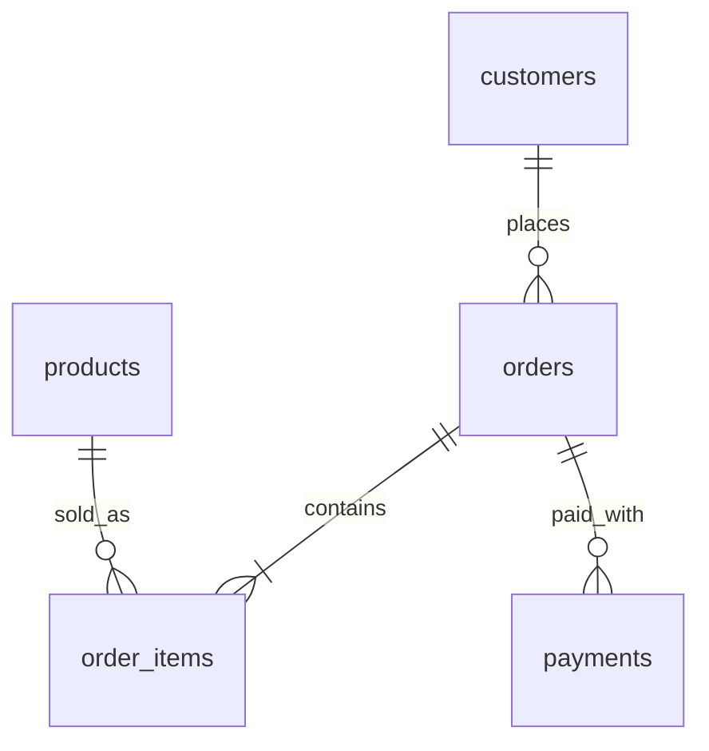

# Enterprise Sales & Customer Data Platform

[](https://github.com/Owais4077/Enterprise-Sales-Medallion-Lakehouse/actions)

> Status: **Phase 16 of 16 complete (100% complete)**. Production-grade Medallion Lakehouse on PySpark & Delta Lake with Airflow Orchestration, Data Quality Framework, CI/CD, and Power BI Analytics.

## 1. Project overview
End-to-end data engineering project: ingest sales data from PostgreSQL, a REST API and files,
process it through a Bronze/Silver/Gold lakehouse on Delta Lake with PySpark, orchestrate with
Airflow, validate with automated data-quality checks, and serve a star schema to Power BI.

## 2. Business problem
Modern enterprise sales platforms process multi-channel data (e-commerce orders, REST API exchange rates, customer reviews, payment gateways). Raw operational data often suffers from schema drift, missing attributes, duplicate transactions, and non-USD currencies. This project builds a production-grade Medallion Lakehouse to ingest, clean, quarantine bad records, convert currency, and build a unified Star Schema for executive Power BI dashboards.

## 3. Architecture
See [docs/architecture.md](docs/architecture.md) for full architectural design and pipeline flowcharts.

## 4. Technology stack
Python 3.11+, PySpark, Delta Lake, Airflow 2.8, PostgreSQL 15, Docker, GitHub Actions, FastAPI, Pytest, Ruff, Black, Power BI.

## 5. Data sources
PostgreSQL operational DB (customers, orders, order_items, payments, reviews), mock REST API (daily currency rates), and CSV/JSON files (product catalog, country lookup) with injected quality defects.
See [docs/data_sources.md](docs/data_sources.md).

## 6. Data model
Source schema DDL: [sql/postgres/001_schema.sql](sql/postgres/001_schema.sql).

Gold Star Schema: [src/edp/transformations/gold.py](src/edp/transformations/gold.py) (`dim_customer`, `dim_product`, `dim_country`, `dim_date`, `fact_sales`).

## 7. Bronze / Silver / Gold architecture
- **Bronze Layer**: Raw append-only Delta tables with metadata tracking (`ingestion_timestamp`, `source_system`, `batch_id`).
- **Silver Layer**: Cleansed, typed, deduplicated Delta tables with Delta `MERGE INTO` upserts and automatic quarantine routing.
- **Gold Layer**: Dimensional star schema (`fact_sales` with USD conversion, dimension tables, monthly KPI aggregations).

## 8. Pipeline workflow
Extraction pipeline with watermarks, atomic landing batches, exponential retries, and audit logging:
```bash
docker compose run --rm app python -m edp.ingestion
```
Full DAG orchestration: [dags/edp_daily_pipeline.py](dags/edp_daily_pipeline.py).

## 9. Incremental processing
PostgreSQL bounded `updated_at` watermarks, API `updated_since`, file SHA-256 integrity checks, and Silver layer `MERGE INTO` deduplication. Details: [docs/ingestion.md](docs/ingestion.md).

## 10. Data quality
Rule-based assertion framework (`NullCheck`, `RangeCheck`, `SetCheck`, `UniqueCheck`, `ReferentialIntegrityCheck`). Details: [src/edp/quality/](src/edp/quality/).

## 11. Airflow
Daily & hourly Airflow DAGs with SLA monitoring and error task handlers. Details: [dags/](dags/).

## 12. Docker
Full Docker Compose setup for PostgreSQL, Mock API, Airflow, PySpark, and Vercel serverless deployment.

## 13. CI/CD
Automated GitHub Actions workflow executing ruff linting, black code formatting, pytest unit tests, and integration tests.

## 14. AWS architecture
Production cloud deployment guide (S3 Lakehouse, RDS PostgreSQL, EMR/Databricks). Details: [infra/aws/README.md](infra/aws/README.md).

## 15. Power BI
Star schema metrics and DAX measures (`Total Sales USD`, `YTD Revenue`, `Average Order Value`). Details: [dashboards/powerbi_dax.md](dashboards/powerbi_dax.md).

## 16. Testing
```bash
pytest                 # unit tests
ruff check .           # linting
black --check .        # code formatting
```

## 17. Monitoring
Full operational monitoring views (`vw_pipeline_run_summary`, `vw_pipeline_failed_runs`, `vw_dataset_ingestion_watermarks`). Details: [sql/analytics/001_pipeline_audit_views.sql](sql/analytics/001_pipeline_audit_views.sql).

## 18. Security
Secrets isolated in `.env` (git-ignored). Copy `.env.example` to `.env` before running.

## 19. Local setup
```bash
cp .env.example .env                           # set environment variables
docker compose up -d --build postgres mock-api  # launch services
docker compose run --rm app python -m data_generation.generate all   # generate synthetic data
docker compose run --rm app python -m edp.ingestion   # run incremental ingestion
docker compose run --rm app pytest              # execute tests
```

## 20. Deployment
Vercel serverless deployment (`api/index.py` & `vercel.json`) rendering live project executive dashboard.

## 21. Pipeline execution
Step-by-step pipeline execution walkthrough. Details: [docs/pipeline_execution.md](docs/pipeline_execution.md).

## 22. Future improvements
Streaming ingestion with Structured Streaming and Delta Live Tables (DLT).

## Repository layout
```
src/edp/            installable package (common, ingestion, transformations, quality)
dags/               Airflow DAGs (thin wrappers)
sql/                Postgres DDL and analytics views
data_generation/    synthetic data + mock API
config/             pipeline YAML (no secrets)
tests/              unit and integration tests
docker/             Dockerfiles
dashboards/         Power BI requirements and DAX
infra/aws/          optional cloud deployment guide
docs/               architecture, ADRs, data sources
```
