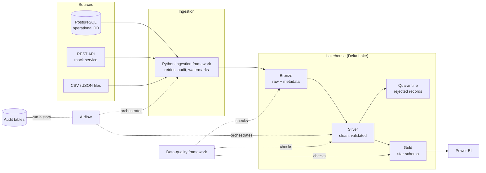
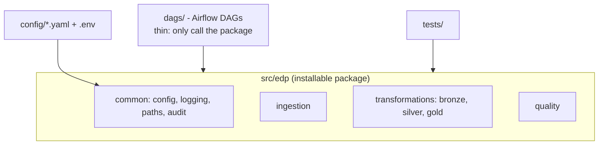

# Architecture

## End-to-end flow

## Layers

| Layer | Contents | Rule |
|---|---|---|
| Bronze | Raw source data in Delta + `ingestion_timestamp`, `source_system`, `batch_id`, `file_name` | Never modify source values. Append-only history. |
| Silver | Typed, deduplicated, validated, standardised | Bad rows go to quarantine with a reason, never dropped silently. |
| Gold | `fact_sales`, `dim_customer`, `dim_product`, `dim_date`, `dim_country` + KPI tables | Business-ready, shaped for Power BI. |
| Audit | Pipeline runs and data-quality results | Every run is recorded, success or failure. |

## Where code lives

Business logic lives in `src/edp` so it can be unit-tested without Airflow or a cluster.
DAGs only schedule and wire steps together.

## Local vs cloud

| Concern | Local (default) | Optional cloud |
|---|---|---|
| Lake storage | `data/lake/` on disk | S3 (`STORAGE_BACKEND=s3`) |
| Source DB | Postgres container | RDS PostgreSQL |
| Compute | Spark in Docker | Databricks (deployment guide, Phase 13) |

Cloud usage is opt-in. Nothing in this repo is described as deployed unless it has been run.
