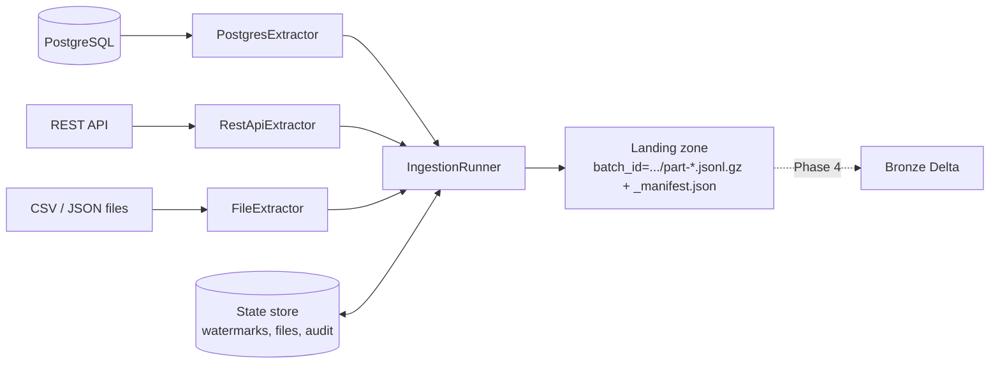

# Ingestion framework

Code: [src/edp/ingestion/](../src/edp/ingestion/). Config: `ingestion:` and `sources:` in
[config/pipeline.yaml](../config/pipeline.yaml).

## What it does

Pulls data from PostgreSQL, a REST API and CSV/JSON files into a **landing zone**, ready for the
Bronze load (Phase 4). Every run is incremental, atomic, retried where safe, and audited.



## Run it

```bash
docker compose run --rm app python -m edp.ingestion                       # everything, incremental
docker compose run --rm app python -m edp.ingestion --source postgres --dataset orders customers
docker compose run --rm app python -m edp.ingestion --full-refresh        # ignore watermarks
```

Exit codes: `0` success, `1` a dataset failed, `3` finished but some files were rejected.
One failing dataset never stops the others.

## Landing zone layout (`data/landing/`)

```
<source_system>/<dataset>/batch_id=20260105T101500Z-3fa9c1d2/
    part-00000.jsonl.gz        rows from database/API sources (values kept lossless)
    <original file name>       file sources: byte-for-byte copies
    _manifest.json             record counts, checksums, watermark range, run id, rejected files
```

Hidden `.tmp-batch_id=...` folders are in-progress batches; Bronze must ignore them.

## How a run works (and why the order matters)

1. read the stored **watermark** for the dataset
2. write a `running` row to the audit table
3. the extractor writes into a hidden temporary batch
4. the batch is published by an **atomic rename**, so readers never see half a batch
5. watermark and processed-file records are updated in **one transaction**
6. the audit row is closed as `success` / `partial`

Failure before step 5: temp batch deleted, watermark unchanged, audit row `failed` with error
type and message, exception re-raised. The next run retries the same window.
Crash between steps 4 and 5 (process killed): the batch exists but the watermark did not move,
so the next run lands the same rows again. This is **at-least-once** delivery; Silver
deduplicates on business key + `updated_at`. Exactly-once is not claimed.

## Incremental strategy per source

| Source | How "new" is defined | Boundary behaviour |
|---|---|---|
| PostgreSQL | window `(watermark, db_now - lag]` on `updated_at`, one `REPEATABLE READ` read-only transaction | no overlap. New watermark = upper bound, even for an empty window |
| REST API | `updated_since = watermark` (API uses `>=`), paginated | rows at exactly the watermark are re-read: a few rows per run, handled downstream |
| Files | `(file name, sha256)` not seen before | same name + new content = new version; rejected files are reported every run |

**Why the lag?** `updated_at` is stamped when a transaction *starts*, but it becomes visible
when it *commits*. A slow transaction could therefore commit a row with a timestamp *older*
than our watermark, and we would skip it forever. Reading only rows older than `now - lag`
(default 30 s) gives such transactions time to commit. It does not help for transactions longer
than the lag; raise `watermark_lag_seconds` if the source has long-running writers.

**Why the database clock?** Using `now()` from the database avoids clock skew between the
pipeline host and the source.

**Known limits** (documented rather than hidden): `order_items` rows are only re-extracted if
the item row itself changes (a parent order change does not bump them); hard deletes in the
source are invisible to `updated_at` watermarks (a later phase can add a delete-detection pass).

## Retries

`call_with_retry` implements exponential backoff (1 s, 2 s, 4 s ... capped), +/-20% jitter, and
honours `Retry-After`. Only transient errors are retried: timeouts, connection errors, HTTP 429
and 5xx, and the initial PostgreSQL connection. A 401/403, other 4xx, malformed response or a
bug fails at once. Retries apply per HTTP request and per connect; a failure *while streaming*
database rows fails the run (partial data is discarded) and the orchestrator retries the task.

## State and audit

SQLite file (`STATE_DB_PATH`) with three tables, behind a `StateStore` interface:

* `watermarks` - last position per dataset
* `processed_files` - landed file name + hash
* `pipeline_runs` - audit: run id, pipeline, dataset, batch id, start/end, status,
  records extracted/processed/rejected, watermark from/to, error type/message

```bash
sqlite3 data/state/pipeline_state.db "select dataset,status,records_processed,watermark_to from pipeline_runs order by started_at desc limit 10"
```

**Honest limitation:** SQLite is right for a single-machine setup and is what runs here. A shared
production deployment would implement `StateStore` on PostgreSQL (e.g. RDS) or DynamoDB; the
runner does not change.

## Interview explanation

> "I separated *extraction* from *loading*. Extractors only read a source and write a batch;
> a runner wraps every extractor with the same guarantees: it reads the watermark, writes into a
> temporary directory, publishes with an atomic rename, then advances the watermark in the same
> transaction as the file bookkeeping, and audits the run either way. If anything fails the
> watermark does not move, so the pipeline is restartable and idempotent downstream. For
> PostgreSQL I read a bounded window on the database's clock with a small lag to avoid missing
> late-committing transactions. Delivery is at-least-once and I deduplicate in Silver, because
> exactly-once across systems is expensive and usually unnecessary."

Likely questions: why a watermark rather than a full reload; what if a transaction commits late;
what if the process crashes after writing but before saving the watermark; how are retries
distinguished from permanent errors; how do you avoid thundering herds (jitter); why not Spark
for extraction (small data, simpler to test; Spark is used where it adds value).
