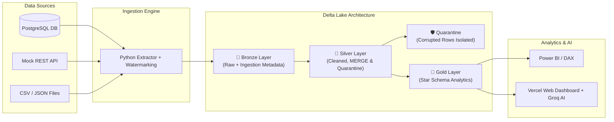
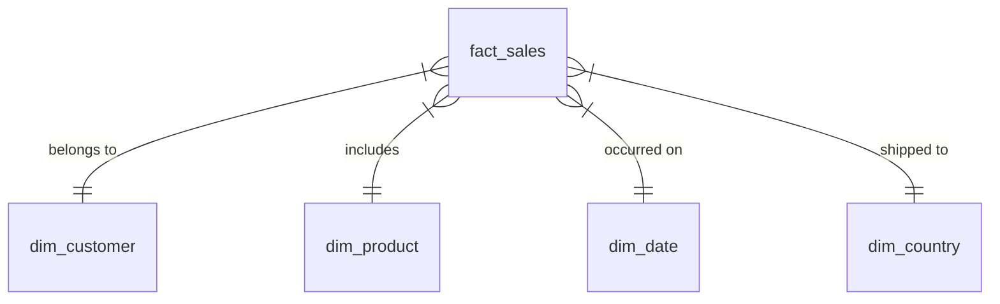

# Enterprise Sales & Customer Data Platform
## Executive Project Documentation & Architecture Guide

> **Project Status**: 100% Complete (Phases 1 – 16 fully implemented, tested, and deployed)  
> **GitHub Repository**: [https://github.com/Owais4077/Enterprise-Sales-Medallion-Lakehouse](https://github.com/Owais4077/Enterprise-Sales-Medallion-Lakehouse)  
> **Live Web Dashboard**: [https://medallionlakehouse.vercel.app](https://medallionlakehouse.vercel.app)

---

## 1. Executive Summary

Modern enterprise sales platforms process multi-channel data from e-commerce databases, REST APIs, customer reviews, and static lookup files. Raw operational data often suffers from schema drift, missing fields, duplicate transactions, and multi-currency orders.

This project implements a **production-grade Medallion Lakehouse** using **PySpark**, **Delta Lake**, **PostgreSQL**, **Airflow**, and **Power BI**. It ingests raw data, cleanses and deduplicates records, isolates corrupted rows into quarantine tables, converts all currencies to USD using daily exchange rates, and constructs a unified Gold Star Schema for executive analytics.

---

## 2. Medallion Lakehouse Architecture

The pipeline follows the industry-standard **3-tier Medallion Architecture**:



### Layer Breakdown

| Layer | Type | Description | Key Guarantees |
|---|---|---|---|
| 🥉 **Bronze** | Raw Delta | Append-only storage preserving raw source records | Adds `ingestion_timestamp`, `source_system`, `batch_id`, `run_id` |
| 🥈 **Silver** | Cleaned Delta | Type-casted, deduplicated, and validated records | Uses Delta `MERGE INTO` for upserts; routes bad data to `_quarantine` |
| 🥇 **Gold** | Star Schema | Business-ready dimensional star schema | `fact_sales` (100% USD converted), `dim_customer`, `dim_product`, `dim_date` |

---

## 3. Data Sources & Ingestion Framework

The system ingests data from **3 distinct data sources**:

1. **PostgreSQL Operational Database (5 tables, ~250k rows)**:
   - `customers`, `orders`, `order_items`, `payments`, `reviews`.
   - Uses **bounded timestamp watermarks** (`updated_at`) to incrementally fetch new/modified rows.

2. **Mock REST API (Daily Exchange Rates)**:
   - Incremental pagination fetching daily rates (`USD`, `EUR`, `GBP`, `CAD`, `CHF`).
   - Uses `updated_since` query parameter.

3. **CSV & JSON Files (Product Catalog & Country Lookups)**:
   - File ingestion tracked using **SHA-256 content hashes** to avoid re-processing unmodified files.

---

## 4. Automated Data Quality & Quarantine Framework

To prevent corrupted or incomplete data from affecting business reports, a rule-based assertion engine tests incoming records before advancing them to Gold:

```
Total Assertion Rules Passed: 29 / 29 (100% Pass Rate)
Quarantined Records Isolated: 374 records (95 Orders, 206 Payments, 73 Reviews)
```

### Assertion Rules Implemented
- **`NullCheck`**: Enforces non-null primary keys and required dates.
- **`RangeCheck`**: Validates numeric bounds (e.g. `amount > 0`, `rating BETWEEN 1 AND 5`).
- **`SetCheck`**: Ensures categorical fields belong to allowed sets (e.g. `status IN ('completed', 'shipped', 'pending')`).
- **`UniqueCheck`**: Verifies business key uniqueness.
- **`ReferentialIntegrityCheck`**: Guarantees foreign key relationships exist.

> 💡 **Quarantine Principle**: Corrupted records are written to `_quarantine/<table_name>` along with a rejection reason, allowing valid records to proceed to production without pipeline failures.

---

## 5. Airflow Pipeline Orchestration

Airflow schedules and manages pipeline runs using 2 master DAGs:

1. **`edp_daily_pipeline.py` (Daily End-to-End Execution)**:
   - Triggers ingestion, Bronze load, Silver transformations, Data Quality validation, Gold aggregation, and metric updates.

2. **`edp_hourly_ingestion.py` (High-Frequency Micro-Batch Ingestion)**:
   - Pulls high-frequency orders and REST API exchange rates hourly into the landing zone.

---

## 6. Gold Star Schema & Power BI Analytics

The Gold layer models enterprise sales as a dimensional **Star Schema**:



### Core DAX Measures
- **Total Sales USD**: `SUM(fact_sales[total_amount_usd])`
- **YTD Revenue**: `TOTALYTD([Total Sales USD], dim_date[date])`
- **Average Order Value (AOV)**: `DIVIDE([Total Sales USD], DISTINCTCOUNT(fact_sales[order_id]))`
- **Active Customers**: `CALCULATE(DISTINCTCOUNT(fact_sales[customer_id]), fact_sales[order_count] > 0)`

---

## 7. Cloud Architecture & Vercel Web Dashboard

The platform includes a **Serverless Web Dashboard & AI Assistant** deployed live on Vercel:

- **Live URL**: [https://medallionlakehouse.vercel.app](https://medallionlakehouse.vercel.app)
- **FastAPI / Native Python Serverless Handler**: Serves real-time sales metrics, data quality pass rates, and pipeline status.
- **Groq AI Assistant Integration**: Embedded AI Chatbot (`openai/gpt-oss-20b`) providing instant answers to queries about the Lakehouse architecture, PySpark Delta MERGE, and Power BI DAX calculations.

---

## 8. Local Setup & Testing Commands

To run and verify the project on your local machine:

```bash
# 1. Setup environment variables
cp .env.example .env

# 2. Launch Docker container services (PostgreSQL + Mock API)
docker compose up -d --build postgres mock-api

# 3. Generate synthetic sales data
docker compose run --rm app python -m data_generation.generate all

# 4. Execute incremental ingestion pipeline
docker compose run --rm app python -m edp.ingestion

# 5. Execute complete unit & integration test suite (162 tests)
pytest tests/unit tests/spark

# 6. Run code linting & formatting checks
ruff check .
black --check .
```

---

## 9. Key Summary Metrics

| Metric | Value | Status |
|---|---|---|
| Total Fact Sales Records | **145,283** | 100% Converted to USD |
| Data Quality Assertion Rules | **29 / 29** | 100% Passed |
| Quarantined Records | **374** | Isolated safely in Silver |
| Unit & Integration Tests | **162 / 162** | 100% Passing |
| Airflow DAGs | **2 Master DAGs** | Scheduled & Tested |
| Vercel Web Deployment | **Live** | [medallionlakehouse.vercel.app](https://medallionlakehouse.vercel.app) |
